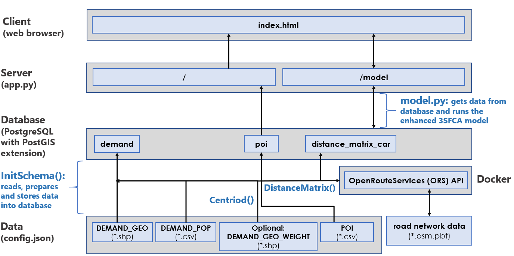

# Potential Spatial Accessibility Software Service (PASS)

The CDO Data Science team developed a geographic information system, Potential Accessibility Software Service (PASS). PASS offers an advanced quantitative approach to measure how spatially accessible population demand is to a given service.

Spatial accessibility is the consideration of how physical and social space and place affect how a population can traverse through it to access given service locations (i.e., points of interest, POIs). Though abstract in nature, it can be measured through considerations like where potential population demand is located, the geographic distance to get from the population location to the service locations offered, the supply at the service locations, as well as the probability of a population going to one service location over another based on the capacity. PASS uses the enhanced 3-Step Floating Catchment Area (3SFCA) methodology to accomplish this, which is further explained [in a report, which should be downloaded and viewed in your web browser](https://dsd-esdc-edsc.github.io/pass/).

PASS lets you select a geographic area of interest by panning and zooming on the interactive map, and lets you define the parameters to model spatial accessibility to better reflect Canada's diverse society. For example, individuals living in urban areas versus rural areas, have different assumptions (e.g., willingness to commute further distances) and considerations (e.g., transportation) for how to access a service.

# Installation

### Dependencies

- Python > 3.6
- PostgreSQL > 11
- PostGIS (PostgreSQL extension) > 2.5 (NOTE: This will need to be installed separtely from PostgreSQL.)
- Docker

### Steps to Install

1. Make sure you have the above dependencies installed.
2. Clone repo.
3. Set up a Python environment in the terminal, you can use the `requirements.txt` file to clone the environment, but there might be some issues installing some of the Python packages, especially if you have a Windows OS. In this case, it is recommended to create a new environment and then `pip install` the individual dependencies listed in `requirements.txt`. If you have a Windows OS, it is suggested to review [this Stack Overflow conversation](https://stackoverflow.com/questions/29222269/is-there-a-way-to-have-a-conditional-requirements-txt-file-for-my-python-applica) to assure the dependencies are installed correctly.
4. Within the `/data` folder, you should have the following types of data:

- `DEMAND_GEO`: Geographic data file (`*.shp`) representing your demand locations (e.g., shapefile of postal code polygons).
- `DEMAND_POP`: `*.csv` file that at least has the demand geographic data file IDs and a variable to represent the population counts for the demand geographic data file.
- `SUPPLY`: `*.csv` file that stores your POIs, this file should at least have a variable to represent the POI IDs and two variables for longitude and latitude.
- `DEMAND_GEO_WEIGHT` (optional): a more granular geographic data file (`*.shp`) + a population attribute/variable for calculating mean-weighted centroids to represent the demand locations more precisely.

  There currently is dummy test data in the `/data` folder as a guide. Requirements for these data files are further detailed in the [Database Initialization and Population document](docs/pass_config.md).

5. Copy and rename `config_template.json` to `config.json`. Enter the necessary values in where it specifies "ENTER ...". There is also a `config_example.json` to better demonstrate the values that should be presented in `config.json`, these values are aligned with the dummy data stored within the `/data` folder. **Please refer to the [Database Initialization and Population document](docs/pass_config.md) for more information on how to properly prepare `config.json`.**
6. Initialize a new database and add the [PostGIS](https://postgis.net/) database extension to store the geographic data and leverage the geospatial functions that can be called within a PostgreSQL query. Make sure to add the PostgreSQL database connection information to `config.json`. (NOTE: To initialize PostGIS, you need to first install it.)
7. Now you have to populate the database based on your data, which can be accomplished by running the following command in the terminal: `python modules/InitSchema.py`. **However, before running this Python script, you will need to initialize a local API for calculating a distance matrix for car commute time or distance. To learn more about how to set up the API for calculating a distance matrix, refer to the [Distance Matrix Calculation Set Up Instructions document](docs/pass_distance_matrix_api.md).**
8. Run `python modules/InitSchema.py` to initialize your database, this could take a while depending on your computer specs and the total data size (e.g., all of Canada could take over 5 hours).
9. Confirm your database has three populated data tables: `demand`, `poi`, and `distance_matrix_car`.

# Run

Once you completed the 'Steps to Install', which you only need to complete once, to run the actual web app from now on, you must complete the following:

1. Activate your Python environment, e.g., `source activate pass`
3. Run `app.py` in terminal: `python app.py`
4. After running the command, go to your browser, and you can open the app with your provided `HOST:PORT`

# Development

Below is an image of PASS's architecture.

To learn about how to calculate the distance matrix, refer to the [Distance Matrix Calculation Set Up Instructions document](docs/pass_distance_matrix_api.md).

To learn more about the data configuration and database population, refer to the [Database Initialization and Population document](docs/pass_config.md).

The following are areas that could be further developed:

- Allowing for either web or local containerized version of the ORS API.
- Incorporating a `distance_matrix_transit` database table that stores a distance matrix calculated by General Transit Feed Specification (GTFS) data to account for public transportation. Some work has been started for this. The `modules/gtfs.py` script collects all GTFS feeds and data in Canada and then can be used with the Open Transit Planner API that handles calculating distance matrix with GTFS and OpenStreeetMap (`*.osm.pbf`) road network data.

# Contribute

- Assign yourself to an issue, or create an issue
- Create new branch related to that issue
- Pull from master branch (this might get updated eventually to dev once a first version is stable)
- Work on your branch, when you have completed the code and tested it, you can then push the branch to the remote repository
- Make a merge/pull request, admin will review and merge into whichever branch
