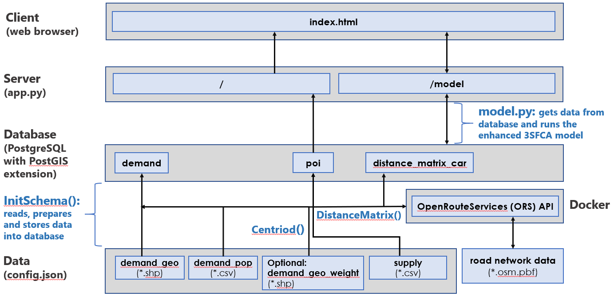

# Database Initialization and Population

To populate the database with the necessary data for PASS to run, you will need to execute the `InitSchema` Python class before starting the PASS web app. **It is highly recommended to read the [PASS report that details the methodology to measure spatial accessibility](./pass_report_20200422.html), specifically the 'Floating Catchment Area (FCA) Methods: 2SFCA and Enhanced 3SFCA Models' and 'Data' sections, to better understand why the following data is necessary for PASS to operate. Moreover, the [README](../README.md) explains the architecture of PASS to better explain the `InitSchema` class**. 

The `InitSchema.py` file runs several different modules to read, process and store the necessary data for PASS. The image below demonstrates this. 



**For this Python script to successfully run, the following steps must be completed prior**:

1. Set up a `config.json` in the root directory. A quick way to accomplish this is by copying and then renaming the `config_template.json` to `config.json` and then changing the values that start with "ENTER" within the JSON. There is also a `config_example.json` to better demonstrate the values that should be presented in `config.json`. Please refer to the section below, 'Specifications for config.json', to learn more on how to prepare this file for successful read. 

2. Connect to either a local or web version of the [OpenRouteService (ORS)](https://github.com/GIScience/openrouteservice) API for calculating a drive time/distance matrix.
  - `InitSchema.py` runs the `DistanceMatrix` class that connects to this API to calculate drive time/distance isochrones (i.e., buffer areas of equal travel time/distance) and then a distance matrix file to be stored in the database. 
  - `DistanceMatrix` depends on the `client_url` parameter, which is in `config.json`. **For information on how to install the ORS API locally, refer to the [Distance Matrix Calculation Set Up Instructions](/pass_distance_matrix_api.md)**.

3. Assuming [PostgreSQL](https://www.postgresql.org/) is already installed, initialize a new database and add the [PostGIS](https://postgis.net/) database extension to store the geographic data. Make sure to add the PostgreSQL database connection information to `config.json`.

## Specifications for `config.json`

The `config.json` file is meant to describe your data sources for `InitSchema.py` to read, prepare and store into the PostgreSQL database (`files` key); moreover, it provides the following: (1) connection information for the database (`DB` key), (2) connection information for the `DistanceMatrix` local API (`ORS` key), (3) app configuration variables (`APP` key), and (4) variables for logging (`LOGGER` key). The `config_template.json` file can be used to build a version of `config.json` by simply copying and renaming `config_template.json` to `config.json` and storing it in the same root folder. There is also a `config_example.json` to better demonstrate the values that should be presented in `config.json`. This section explains the necessary and optional objects that need to be present in this JSON.

### FILES

The `FILES` object specifies the files necessary to read, process and store data into the database for PASS to operate. The `FILES` object and their key/values that **need** to be in `config.json` are the following:

- `DEMAND_GEO`: The polygon vector `*.shp` (i.e., shapefile) of the desired geographic unit to represent where the population demand is geographically situated. The `Centroid` creates centroid point locations from this polygon shapefile. The calculated centroids can be weighted by smaller geographic units using the `DEMAND_GEO_WEIGHT` configuration object, specified below. The polygon vectors are used to visualize the spatial accessibility scores as a choropleth map. 
  - `FILE`: The file path to the specific `*.shp` (shapefile).
  - `TYPE`: The value for this should stay as `demand`, it is for scripting purposes.
  - `CRS`: Provide the coordinate reference system of your shapefile (3347 represents the EPSG for Statistics Canada's Lambert Conformal Conic projection).
  - `COLUMNS`
    - `ID`: The attribute/column within the shapefile that represents the polygon IDs.
    - `GEOMETRY`: Given the current design of PASS, when modifying `config.json` for `InitSchema` to run, use the same text that is present in `config_template.json` or `config_example.json`
  
- `DEMAND_POP`: The `*.csv` of `DEMAND_GEO` geographic unit's population. This file should have one column that can link the population value columns to the `DEMAND_GEO` geographic polygon file (`ID`).
  - `FILE`: The file path to the `*.csv`.
  - `TYPE`: The value should be "demand".
  - `ENCODING`: The encoding to interpret text characters for the web app's user interface.
  - `COLUMNS` 
    - `ID`: The column that can link the population value columns to the `DEMAND_GEO` geographic.
    - `DEMAND_*`: You can add as many different population counts as you like. Create a new key name, and then make sure to specify the `NAME`, `TYPE`, `UNIT`, and `DESC`. **`DESC` needs to stay as "demand"** so that `InitSchema` can interpret the column as a demand population count, which can then allow the user to select different population demand counts to model.
    
    The `InitSchema` class will create a uniform demand population count (i.e., all demand population locations have a population of 1), but you can also add further population counts to represent different types of demand:

- `POI`: The `*.csv` of the desired Points of Interest (POI) (i.e., service) location (latitude and longitude)
  - `FILE`: The file path to the `*.csv`.
  - `TYPE`: The value should be "poi".
  - `ENCODING`: The encoding to interpret text characters for the web app's user interface.
  - `CRS`: Provide the coordinate reference system of your shapefile (3347 represents the EPSG for Statistics Canada's Lambert Conformal Conic projection).
  - `COLUMNS`
    - `ID`: The column that has an unique identifier per each point of interest.
    - `LATITIUDE`: The column that represents the latitude of the POI location.
    - `LONGITUDE`: The column that represents the longitude of the POI location.
    - `INFO_*`: You can add as many different POI location information values are you like. Create a new key name, and then make sure to specify the `NAME`, `TYPE`, `UNIT`, and `DESC`. **`DESC` needs to stay as "info"** so that `InitSchema` can interpret the column as POI information, which can then appear on the map as a popup when a user clicks the POI point locations.
    - `SUPPLY_*`: You can add as many different POI location supply counts as you like. Create a new key name, and then make sure to specify the `NAME`, `TYPE`, `UNIT`, and `DESC`. **`DESC` needs to stay as "supply"** so that `InitSchema` can interpret the column as a POI supply count, which can then allow the user to select different POI supply counts to model. Refer to the [PASS report](./pass_report_20200422.html) to better understand how and why supply counts are used to model spatial accessibility.
    - `CAPACITY_*`: You can add as many different POI capacity values as you like. Create a new key name, and then make sure to specify the `NAME`, `TYPE`, `UNIT`, and `DESC`. **`DESC` needs to stay as "capacity"** so that `InitSchema` can interpret the column as a POI capacity value, which can then allow the user to select different POI capacity values to model. Refer to the [PASS report](./pass_report_20200422.html) to better understand how and why POI capacity values are used to model spatial accessibility.

There is an *optional* object `DEMAND_GEO_WEIGHT` that you can also include to create population weighted centroid, that is the centroid is weighted based on populations at a more granular geographic unit. This is particularly useful if you are using Census geographic boundaries, so for example, to have Dissemination Area centroids weighed based on Dissemination Boundary populations.

For this optional object, the following keys need to be present:
  - `FILE`
  - `TYPE`
  - `CRS`
  - `COLUMNS`
    - `ID`
    - `LRG_ID`
    - `DEMAND_TOTAL`
    - `GEOMETRY`

If you are using multiple `DEMAND_POP` population counts (`DEMAND_*`) for your main geographic unit (`LRG_ID`), please note that the `InitSchema` only calculates a single set of weighed centroids based on *one* population count. Thus, while interacting with the PASS user interface, if you select a different population group to represent the demand (e.g., total single parents), the centroid location is not necessarily representative of where that selected demand population resides.

#### FILES' COLUMNS' Keys/Values

For all of these required and optional files, the column names within the `COLUMNS` object **need** to have the following keys and values within `config.json`:
  - `NAME`: The column name that exists within the data file.
  - `TYPE`: Either the name that will appear on the UI or used for programming (further specified in `config_template.json`).
  - `UNIT`: The data type, either `int` (integer), `float`, or `str` (string).
  
The following is an example of what a completed file would like in `config.json`:

```
  "DEMAND_GEO": {
    "FILE":"C:/Users/Name/Documents/Code/pass/data/lda_000b16a_bc.shp",
    "TYPE":"shape",
    "CRS": "3347",
    "COLUMNS": {
      "ID" : {
        "NAME": "DAUID",
        "TYPE": "geouid",
        "UNIT": "int",
        "DESC": "ID"
      },
      "GEOMETRY": {
        "NAME": "geometry",
        "TYPE": "geometry",
        "UNIT": "geometry", 
        "DESC": "geometry"
        }
    }
  }
```

### ORS

The ORS configuration variables are mainly used as parameters for `DistanceMatrix.py`. The following details what each variable represents:

- `CONNECTION`
  - `CLIENT_URL`: The URL for the web or local [ORS API](../pass_distance_matrix_api.md#car-distance-matrix-with-openrouteservice-ors).
  - `TIMEOUT`: A parameter passed to the ORS client, this was increased from the default to allow for slower internet connection.
- `ISOCHRONES`
  - `CATCHMENT_RANGE`: The catchment range or distance/time threshold, the furthest commuting distance/time. If `CATCHMENT_RANGE_TYPE` is "time", then the unit is seconds (e.g., 3600 is 60 minutes); if the `CATCHMENT_RANGE_TYPE` is "distance" then the unit is meters (integer).
  - `CATCHMENT_RANGE_TYPE`: Whether to calculate as isochrone ("time") or equidistant ("distance"). 
  - `PROFILE`: The mode of transportation, thus what types of road features and tags will be accounted for to calculate the isochrones. In the case for PASS, this should remain as "driving-car". You can test other profiles, however, the OSM data quality for other types of transportation is much lower compared to OSM road networks (text).
  - `SLEEP_TIME`: The parameter used in `DistanceMatrix` to handle multiple requests called to calculate isochrones and distance matrix. This is only useful when calling the ORS web API (integer). 
- `DISTANCE_MATRIX`: 
  - `METRIC`: Either measure "distance" or "time" (text).
  - `UNIT`: If `METRIC` is "distance", then one of the following units can be entered: "m", "km", or "mi". If the `METRIC` is "time", then the unit is "seconds" (text).
  - `SLEEP_TIME`: The parameter used in `DistanceMatrix` to handle multiple requests called to calculate isochrones and distance matrix. This is only useful when calling the ORS web API (integer).

### APP
- `SECRET_KEY`: The app secret key (text).
- `HOST`: The app server host (text).
- `PORT`: The app server port (text).
- `THREADS`: The number of threads used to process the app (integer).

### DB
- `HOST`: The database server host (text).
- `PORT`: The database server port (text).
- `NAME`: The database name (text).
- `PASSWORD`: The database password (text).
- `USER`: The database user (text).

### LOGGER
- `DEFAULT_LEVEL`: Set the default logger level. Refer to the [logging python package's levels](https://docs.python.org/3/library/logging.html#logging.Logger.setLevel)  (text).
- `FILE`: "true" or "false" depending on whether a log file should be created or not (text).
- `FILE_PATH`: The file path and name to create a log file (text).

### HTML

This object stores the text that appears on the web app's user interface. Refer to `config_template.json` for details on what each key/value should be.

## Updating Database

To update the entire database, repeat steps 5-8 under 'Steps to Install' in the [README](../README.md) to update the data in the database.

To update a specific database table, in `InitSchema.py` you can comment out the functions that are called under `create_schema(self)` Python function. For example, if you only want to update the `demand` database table:

```
def create_schema(self):
    "Create each PostgreSQL database table"
    self.init_demand()
    #self.init_poi()
    #self.init_distance_matrix()
``` 

Then in your terminal, assuming you are in the `modules` directory run the following command: `python InitSchema.py`.
