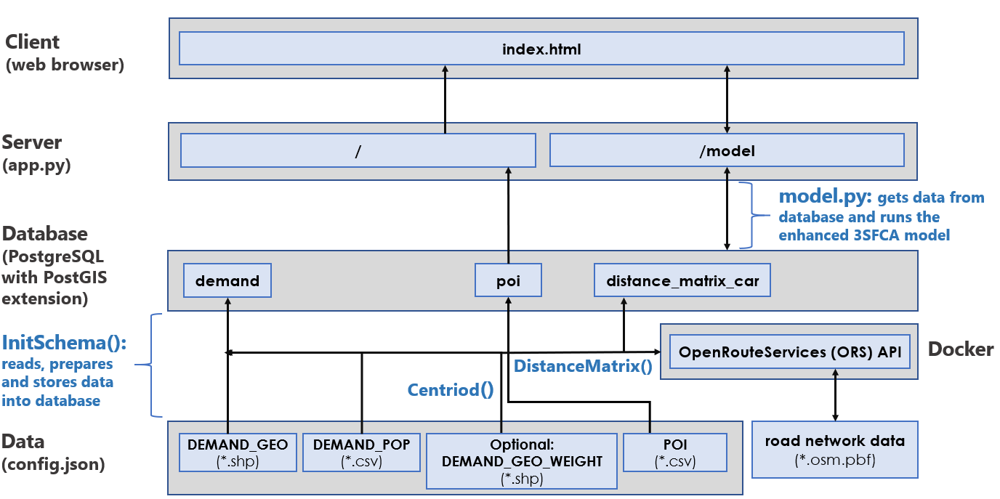

# Database Initialization and Population

To populate the database with the necessary data for PASS to run, you will need to execute the `InitSchema` Python class before starting the PASS web app. **It is highly recommended to read the [PASS report that details the methodology to measure spatial accessibility](./pass_report_20200422.html), specifically the 'Floating Catchment Area (FCA) Methods: 2SFCA and Enhanced 3SFCA Models' and 'Data' sections, to better understand why the following data is necessary for PASS to operate. Moreover, the [README](../README.md) explains the architecture of PASS to better explain the `InitSchema` class**. 

The `InitSchema.py` file runs several different modules to read, process and store the necessary data for PASS. The image below demonstrates this. 

**For this Python script to successfully run, the following steps must be completed prior**:

1. Set up a `config.json` in the root directory. A quick way to accomplish this is by copying and then renaming the `config_template.json` to `config.json` and then changing the values that start with "ENTER" within the JSON. There is also a `config_example.json` to better demonstrate the values that should be presented in `config.json`. Please refer to the section below, 'config.json Specifications', to learn more on how to prepare this file for successful read. 

2. Connect to either a local or web version of the [OpenRouteService (ORS)](https://github.com/GIScience/openrouteservice) API for calculating a drive time/distance matrix.
  - `InitSchema.py` runs the `DistanceMatrix` class that connects to this API to calculate drive time/distance isochrones (i.e., buffer areas of equal travel time/distance) and then a distance matrix file to be stored in the database. 
  - `DistanceMatrix` depends on the `client_url` parameter, which is in `config.json`. Either provide a web client URL (in which case you will need to [sign up for ORS web API](https://openrouteservice.org/plans/)) or set up a local version of the API through a virtual machine / container. If you are working with larger geographic extents (e.g., all of Canada) or want to include other sources of data, it is recommended to host locally to avoid dealing with API call limits. **For information on how to install ORS locally, refer to the [Distance Matrix Calculation Set Up Instructions](/pass_distance_matrix_api.md)**.

3. Assuming [PostgreSQL](https://www.postgresql.org/) is already installed, initialize a new database and add the [PostGIS](https://postgis.net/) database extension to store the geographic data. Make sure to add the PostgreSQL database connection information to `config.json`.

## config.json Specifications

The `config.json` file is meant to describe your data sources for `InitSchema.py` to read, prepare and store into the PostgreSQL database (`files` key); moreover, it provides the following: (1) connection information for the database (`DB` key), (2) connection information for the `DistanceMatrix` local/web API (`ORS` key), (3) app configuration variables (`APP` key), and (4) variables for logging (`LOGGER` key). The `config_template.json` file can be used to build a version of `config.json` by simply copying and renaming `config_template.json` to `config.json` and storing it in the same root folder. There is also a `config_example.json` to better demonstrate the values that should be presented in `config.json`. This section explains the necessary and optional objects that need to be present in this JSON.

### FILES

The `FILES` object specifies the files necessary to read, process and store data into the database for PASS to operate. The `FILES` object and their key/values that **need** to be in `config.json` are the following:

- `DEMAND_GEO`: the polygon vector `*.shp` (i.e., shapefile) of the desired geographic unit to represent where the population demand is geographically situated. The `Centroid` creates centroid point locations from this polygon shapefile. The calculated centroids can be weighted by smaller geographic units using the `DEMAND_GEO_WEIGHT` configuration object, specified below. The polygon vectors are used to visualize the spatial accessibility scores as a choropleth map. 
  - `FILE`: The file path to the specific shapefile (`*.shp`).
  - `TYPE`: The value for this should stay as `demand`, it is for scripting purposes.
  - `CRS`: Provide the coordinate reference system of your shapefile (3347 represents the EPSG for Statistics Canada's Lambert Conformal Conic projection).
  - `COLUMNS`
    - `ID`: The attribute/column within the shapefile that represents the polygon IDs.
    - `GEOMETRY`: The value for this should stay as `geometry`
  
- `DEMAND_POP`: the `*.csv` of `demand_geo` geographic unit's population.
  - `FILE`
  - `TYPE`
  - `ENCODING`
  - `CRS`
  - `COLUMNS` 
    - `ID`
    - `DEMAND_TOTAL`

- `POI`: the `*.csv` of the desired Points of Interest (POI) (i.e., service) location (latitude and longitude)
  - `FILE`
  - `TYPE`
  - `ENCODING`
  - `CRS`
  - `COLUMNS`

There is an *optional* object `demand_geo_weight` that you can also include to create population weighted centroid, that is the centroid is weighted based on populations at a more granular geographic unit. For this optional object, the following keys need to be present:
  - `FILE`
  - `TYPE`
  - `CRS`
  - `COLUMNS`
    - `ID`
    - `LATITUDE`
    - `LONGITUDE`

For all of these files, the following `COLUMNS` key/values **need** to be present in `config.json`:
  - 'NAME': the column name that exists within the data file
  - 'TYPE': either the name that will appear on the UI or used for programming (further specified in `config_template.json`)
  - 'UNIT': the data type, either `int`, `float`, or `str`.

### ORS
- `CONNECTION`
  - `CLIENT_URL`
  - `TIMEOUT`
- `ISOCHRONES`
  - `CATCHMENT_RANGE`: 3600
  - `CATCHMENT_RANGE_TYPE`: time
  - `PROFILE`: driving-car
  - `SLEEP_TIME`: 0
- `DISTANCE_MATRIX`: {
  - `METRIC`: distance
  - `UNIT`: m
  - `SLEEP_TIME`: 0

### APP
- `SECRET_KEY`:
- `HOST`: the app server host 
- `PORT`: the app server port
- `THREADS`: 

### DB
- `HOST`: the database server host
- `PORT`: the database server port
- `NAME`: the database name
- `PASSWORD`: the database password
- `USER`: the database user

### LOGGER
- `DEFAULT_LEVEL`
- `FILE`
- `FILE_PATH`

### HTML

This object stores the text that appears on the web app's user interface. Refer to `config_template.json` for details on what each key/value should be.
